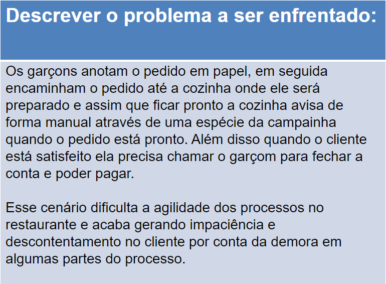
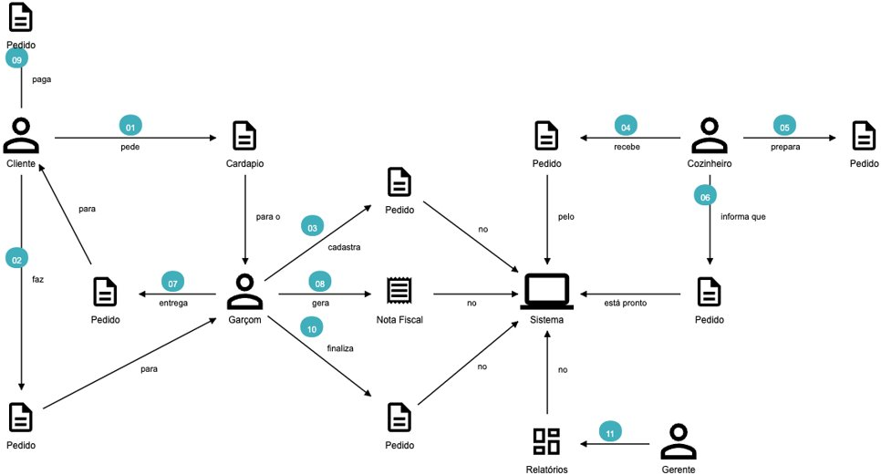
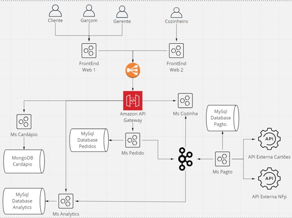

# Microservices Development

Esse é um repositório destinado a entrega final do trabalho final da disciplina de Microservices Development do curso de MBA em Desenvolvimento Full Stack da FIAP.

O objetivo desse projeto é apresentar o desenvolvimento da solução desenhada na primeira parte do trabalho final. Nesse primiera parte nós descrevemos um problema que queriamos resolver, desenhamos o Domain Story Telling e por fim desenhamos uma solução para resolver o problema como pode ser visto abaixo.

#### Descrição do problema

#### Domain Story Telling

#### Desenho da solução

Baseado nessa solução nesse repositório estamos parte da solução técnica, onde desenvolvemos dois dos microserviços mostrados na solução:
- ms-order (Ms Pedido, como está no desenho): //TODO: Descrever a solução e as tecnoligias utilizadas
- ms-menu  (MS Cardápio, como está no desenho): //TODO: Descrever a solução e as tecnoligias utilizadas

## Como configurar o projeto?
//TODO: Descrever o passo a passo de configuração dos projetos
